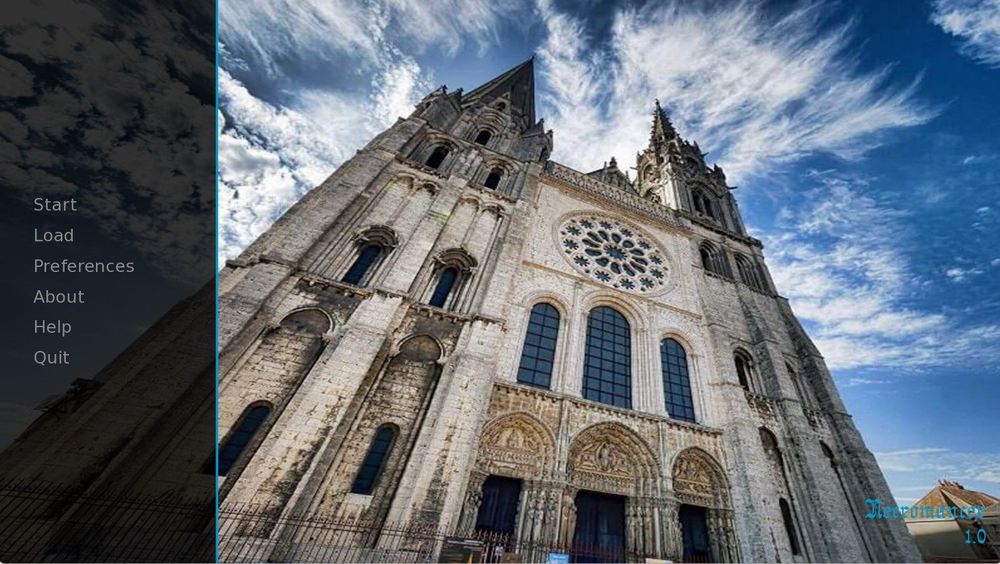
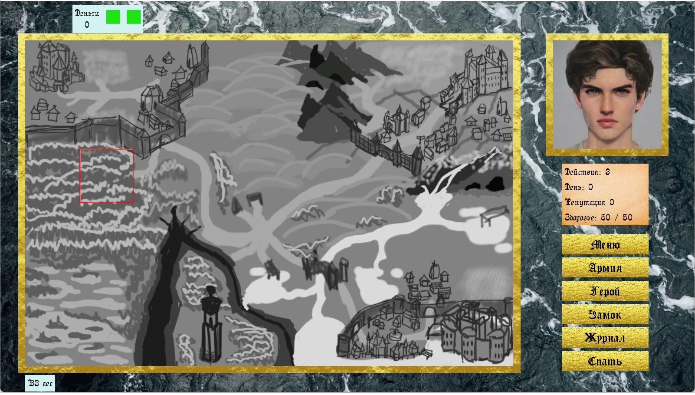
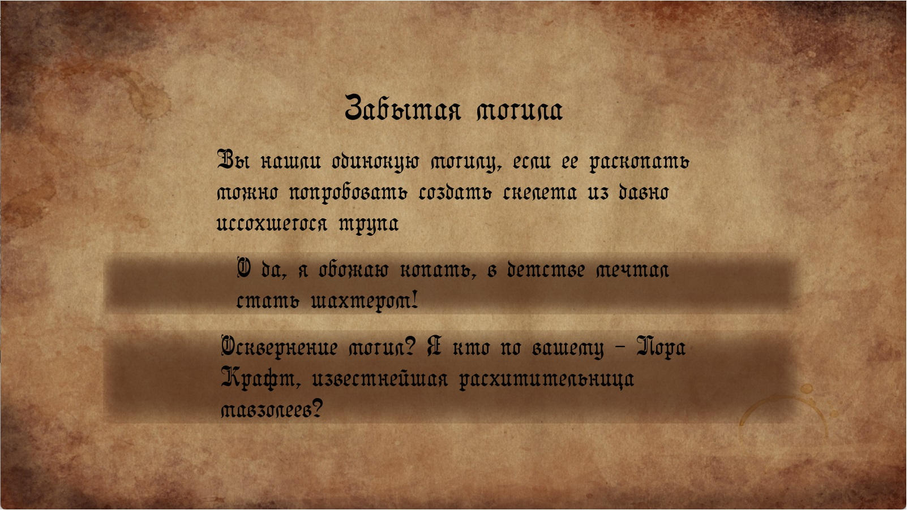
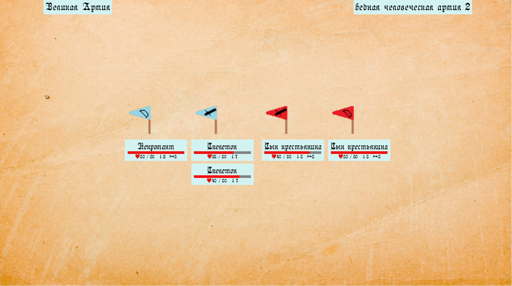
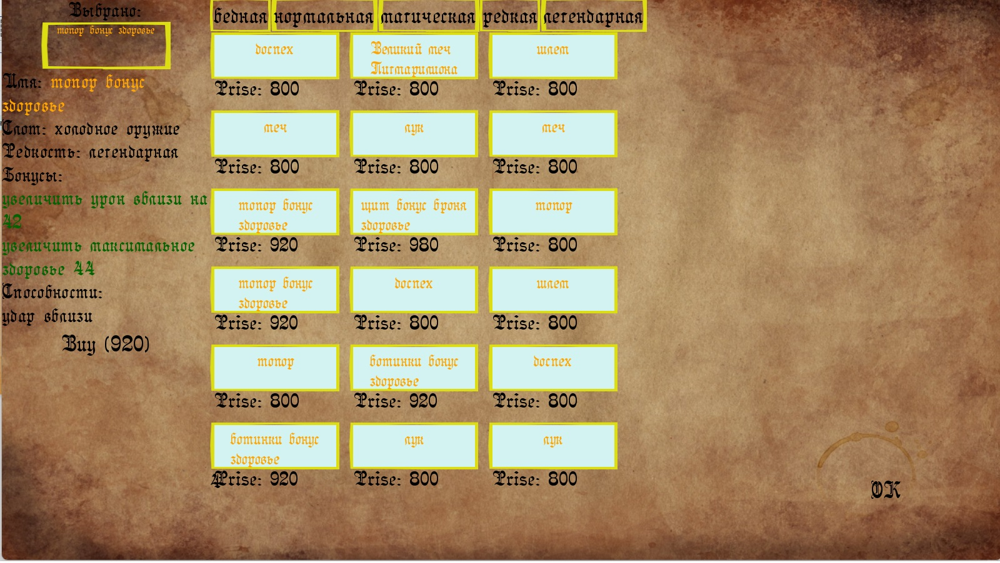

# Скриншоты:

Главное меню:

Игровое поле:

Пример события:

Визуализация битвы (временная):

Покупка итемов на рынке (визуализация в разработке):

# Релиз для ПК:
https://drive.google.com/file/d/174KOQKy56bW7rON-5R7nDwlgnnh9Y7X_/view?usp=sharing

# Описание:
Игра про приключения некроманта в жанре RPG/Strategy. 

В игре некромант побеждает противников и создает из них армию. Чем сильнее противник тем более могущественная нежить может быть создана из его трупа.

Сражения полностью автоматические, игрок влияет на исход сражения только расстановкой войск. 

Некромант и его юниты могут прокачиваться и получать уровни, увеличивая статы.

Некромант имеет инвентарь и может надевать артефакты.

Типы юнитов, события и прочее настраивается из текстовых файлов без перекомпиляции проекта. 

В планах: добавить сюжет и квесты, добавить систему заклинаний и ветки прокачки, наполнить игру контентом.