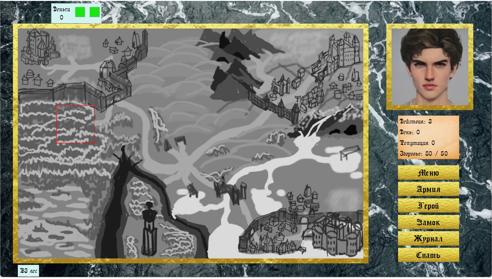
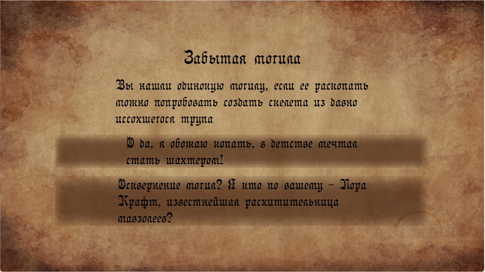
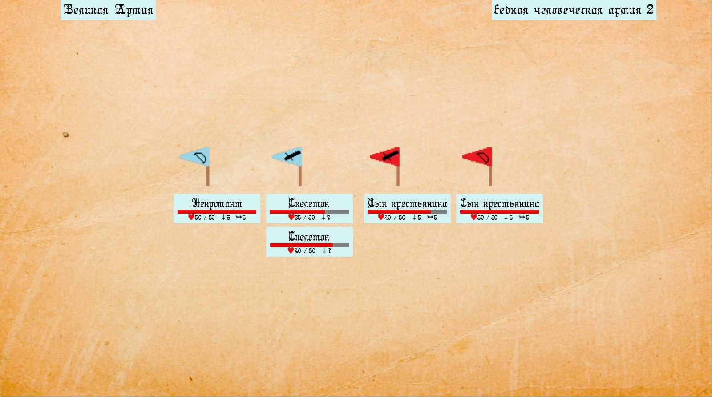
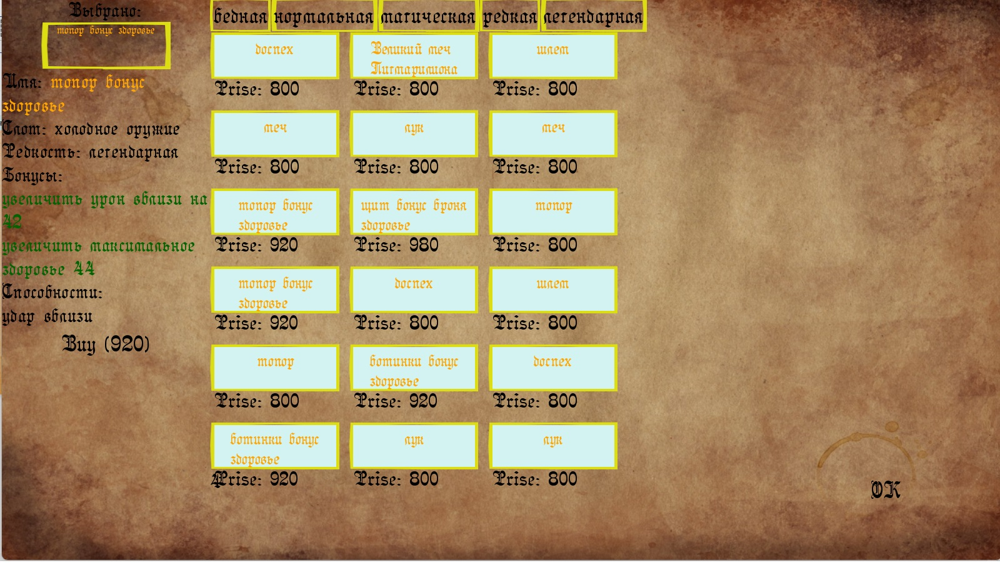

**English** | [🇷🇺 Русский](Readme_ru.md)

# Description:

An RPG/Strategy game about the adventures of a necromancer.

In this game, the necromancer defeats enemies and raises them into an army. The stronger the defeated enemy, the more powerful the undead minion that can be created from their corpse.

Battles are fully automated; the player influences the outcome solely through troop deployment and formation.

The necromancer and his units can level up and increase their stats.

The necromancer features an inventory system and can equip artifacts.

Unit types, events, and other data are configured via text files, allowing changes without project recompilation.

# Future plans:

Add a storyline and quests

Introduce a spell system and skill trees 

Expand the game with more content

# Screenshots:

Main Menu:

Game Screen:

Event Example:

Battle Visualization (placeholder):

Buying Items at the Market (UI in development):

# PC Release:

https://drive.google.com/file/d/174KOQKy56bW7rON-5R7nDwlgnnh9Y7X_/view?usp=sharing
